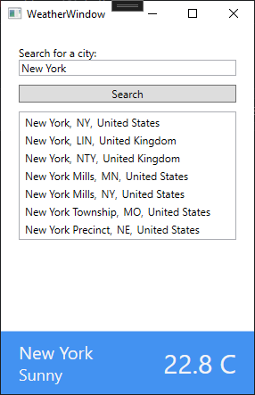

# WeatherApp
 

## Description
Windows application that allows you to display the current weather in the city. The city is entered manually in the search field and then selects your city from among those displayed.

## Architecture
### WPF
The application was developed using .NET Framework WPF.

### MVVM
The application was developed using the mvvm architecture. Implementation of the interfaces was carried out manually without the use of eg mvvm community toolkit.

### Data
Weather data is retrieved via API from weatherap.
